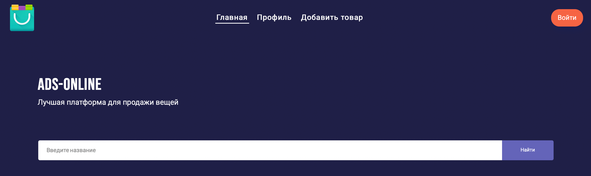
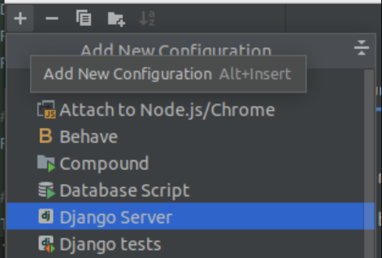
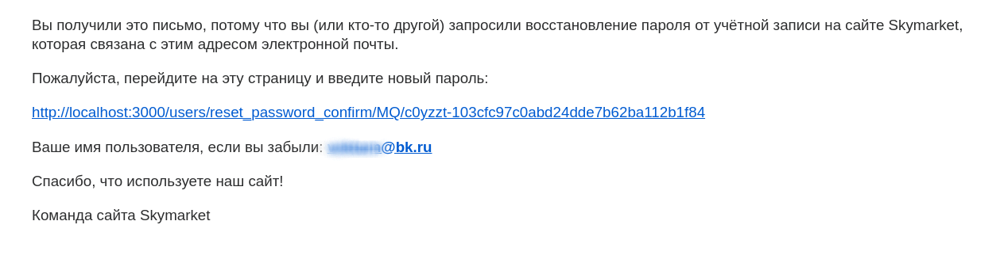
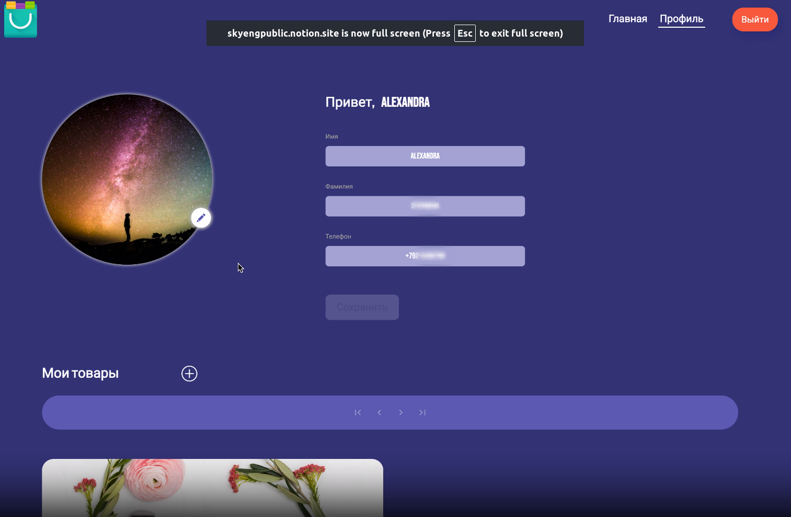
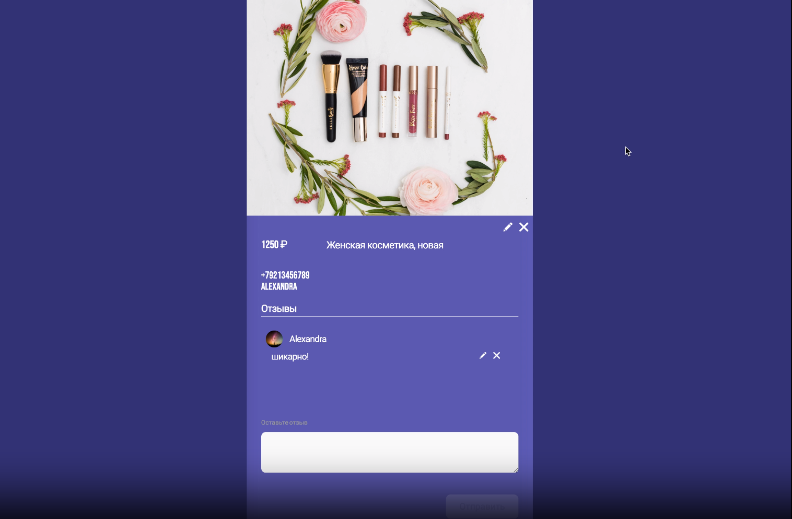

# **SkyMarket** 
Это проект, написанный на языках 

- Python
- JavaScript
- SCSS
- HTML

С использованием библиотек/фреймворков:
- Django REST framework
- Django
- drf-spectacular
- React.js

Сайт объявлений, на котором пользователи могут выставлять и продавать свои товары. Имеет интуитивно понятный и лаконичный 
интерфейс, системы объявлений и отзывов. Backend-часть реализована на основе Django REST framework, а frontend-часть с
помощью библиотеки React.js. </p>


### **Установка**
Для установки проекта SkyMarket, следуйте инструкциям ниже:

**<p>1. Сделайте Fork этого репозитория. Репозиторий появится в ваших личных репозиториях на GitHub.</p>**

**1.1 Сделайте `git clone` форкнутого репозитория, чтобы получить репозиторий локально:**

**<p>2. Перейдите в папку с проектом.</p>**

**<p>3. Создайте и активируйте виртуальное окружение:</p>**

`poetry init`

`poetry shell`

**<p>4. Установите зависимости проекта:</p>**

`poetry install`

**<p>5. Создайте файл .env в корневой папке проекта (/skymarket/) и заполните данные для настройки проекта из файла .env.sample:</p>**

```ini
/.env/

# Django setting
DJANGO_SECRET_KEY=your django secret key

# PostgreSQL connection
DB_ENGINE=django.db.backends.engine
POSTGRES_DB=database name
POSTGRES_USER=postgresql username
POSTGRES_PASSWORD=postgresql password
POSTGRES_HOST=your host
POSTGRES_PORT=your port

# GMAIL connection
EMAIL_HOST=smtp.gmail.com
EMAIL_HOST_USER=example@gmail.com
EMAIL_HOST_PASSWORD=password
EMAIL_PORT = 587
```
или для использования с Docker
```ini
/.env.docker/

# Django setting
DJANGO_SECRET_KEY=your django secret key

# PostgreSQL connection
DB_ENGINE=django.db.backends.engine
POSTGRES_DB=database name
POSTGRES_USER=postgresql username
POSTGRES_PASSWORD=postgresql password
POSTGRES_HOST=container name
POSTGRES_PORT=your port

# GMAIL connection
EMAIL_HOST=smtp.gmail.com
EMAIL_HOST_USER=example@gmail.com
EMAIL_HOST_PASSWORD=password
EMAIL_PORT = 587
```
**<p>6. Перейдите в папку /skymarket/ и примените миграции:</p>**

`python manage.py migrate`

**<p>7. ЗАПУСК BACKEND-ЧАСТИ (/skymarket/): Запустите сервер:</p>**

`python manage.py runserver` или настройте запуск Django сервера в настройках.


Таким образом можно работать с backend-частью локально для отладки.

После запуска сервера. Вы сможете перейти на сайт с документацией http://127.0.0.1:8000/api/docs/ 
(если сервер запущен локально), и начать пользоваться всеми API методами проекта. 

Также вы можете схему данных .yaml файлом по адресу http://127.0.0.1:8000/api/schema/ (если сервер запущен локально).

**<p>8. ЗАПУСК FRONTEND-ЧАСТИ (/frontend-react/): Перейдите в папку /frontend-react/ и воспользуйтесь командами:</p>**

`npm install` для установки зависимостей frontend-части.

`npm start` для локального запуска frontend-части.

Также вам может потребоваться обновления node.js до версии 20.Х.Х и выше.

Таким образом можно работать с frontend-частью локально для отладки.

**<p>9. ЗАПУСК ПРОЕКТА (/market-postgres/): Перейдите в папку /market-postgres/ и воспользуйтесь командами:</p>**

`docker compose build` для создания оптимального билда проекта.

`docker compose up` для запуска docker compose контейнера.

Таким образом можно работать с frontend-частью и backend-частью локально.

При разворачивании docker compose контейнера происходит маппинг портов и backend вне контейнера читается с localhost:8001


### **Использование**
На проекте реализована регистрация новых пользователей, авторизация и выход, также восстановление пароля по email.
Письмо приходит на указанную почту со ссылкой для сброса пароля.


Профиль пользователя


Также реализовано создание, просмотр, редактирование и удаление объявлений и написанных комментариев.


Автор
VictorVolkov7 - vektorn1212@gmail.com